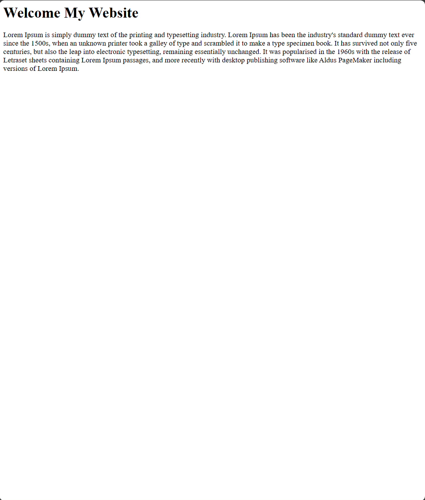
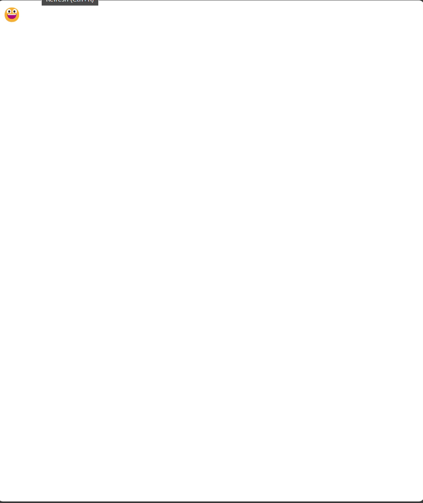

# CSS Animations

## Assignment: Basic Animations

In this assignment, you will create an animated banner for a website. You will use CSS animations to make elements on the page come to life.

  

     
    
    
  

### Instructions

**Part 1: Fade-In animation**
1. Create a "Fade-in" CSS animation for the banner.
   - [x] Animate the banner's text color to gradually transition from white to black
     - [x] Create a 'keyframes' block called 'FadeIn' that will transiton the color property from white to black
     - [x] Define the styles for the "banner" class in your CSS. 
       - [x] Set the text color to white.
       - [x] Bind the animation to the style block by setting the value of the 'animation' property to the name of the keyframes block you created and the amount of time the animation should take  (FadeIn 1s)

**Part 2: Grow animation**
1. Create a "Grow" CSS animation for an emoji.
    - [x] Animate the emoji to grow in size 
       - [x] Create a 'keyframes' block named 'Grow' that will change the font-size of an element to a larger size.
         - [x] Use the 'font-size' property to achieve this 
      - Create a style block for the "#emoji" id
        - [x] Bind the animation to the style block by setting the value of the 'animation' property to the name of the keyframes block you created and the amount of time the animation should take (Grow 1s)

**Part 3: Slide animation**
1. Create a "Slide" CSS animation for an emoji.
    - [x] Animate the emoji to slide from left-screen to right-screen
       - [x] Create a 'keyframes' block named 'Slide' that will change the position of an element from the left side of the screen to the right.
         - [x] Use either the left or the right css property to achieve this 
      - [x] Create a style block for the "#emoji" id
        - [x] Set the position property to 'absolute'
        - [x] Bind the animation to the style block by setting the value of the 'animation' property to the name of the keyframes block you created and the amount of time the animation should take (Slide 3s)

Take a look at Example.png for an idea of how the end result should look.